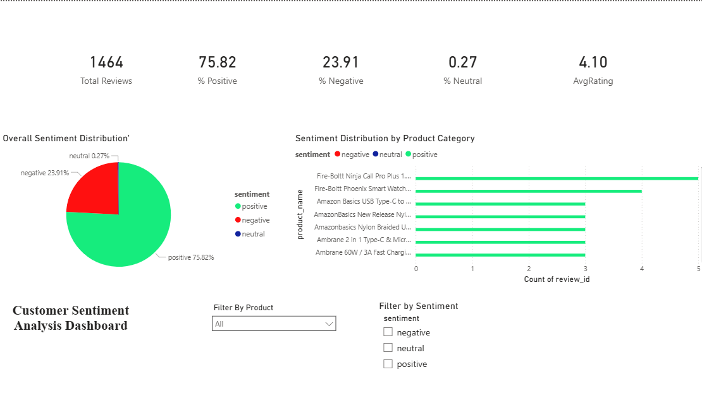

# Customer Sentiment Analysis of Amazon Product Reviews

A machine learning project that analyzes Amazon product reviews 
and classifies them as **positive**, **neutral**, or **negative** using 
Natural Language Processing (NLP) and a Naive Bayes classifier.

---

## Author
- **Name:** Sharanya Saha
---

## Dataset
- **Source:** Amazon Product Reviews (amazon.csv)
- **Key Columns Used:** `review_title`, `review_content`, `rating`, `product_id`

---

## Steps Followed

### Step 1 — Data Loading
- Loaded the dataset using `pandas`
- Checked shape, columns, data types and missing values

### Step 2 — Data Cleaning
- Dropped rows where both `review_title` and `review_content` were missing
- Removed duplicate rows
- Stripped whitespace and converted text to lowercase
- Combined `review_title` and `review_content` into one column `review_text`

### Step 3 — Advanced Text Cleaning
Applied the following using regular expressions (`re`):
- Removed HTML tags
- Removed punctuation
- Removed numbers
- Removed special characters

### Step 4 — NLP Preprocessing
Using `nltk` library:
- **Tokenization** — split text into individual words
- **Stop Word Removal** — removed common words like "the", "is", "and"
- **Lemmatization** — reduced words to their base form
  (e.g., "running" → "run", "better" → "good")

### Step 5 — Sentiment Labelling
Converted numeric ratings into sentiment labels:
```
Rating 4 or 5  →  positive
Rating 3       →  neutral
Rating 1 or 2  →  negative
```

### Step 6 — Train Test Split
- Split data into **70% training** and **30% testing**
- Used `train_test_split` from `scikit-learn`

### Step 7 — TF-IDF Vectorization
- Converted text into numeric format using `TfidfVectorizer`
- Used top **1000 features**
- Removed English stop words

### Step 8 — Model Training
- Trained a **Multinomial Naive Bayes** classifier
- Fitted on TF-IDF transformed training data

### Step 9 — Prediction & Evaluation
- Predicted sentiment on test data
- Evaluated using:
  - Accuracy
  - Precision
  - Recall
  - **F1-Score** (most important for imbalanced data)

### Step 10 — Sentiment Score
- Generated probability scores for each prediction
- Added `predicted_sentiment` and `sentiment_score` columns to dataframe

### Step 11 — Database Storage
- Stored results in **SQLite** database (`sentiment_data.db`)
- Created two tables:
  - `reviews` — original and processed review text
  - `sentiment_predictions` — predicted labels and confidence scores

### Step 12 — Model Saving
- Saved trained model as `sentiment_model.joblib`
- Saved TF-IDF vectorizer as `tfidf_vectorizer.joblib`

---

## Libraries Used

| Library | Purpose |
|---------|---------|
| `pandas` | Data loading and manipulation |
| `re` | Text cleaning with regular expressions |
| `nltk` | Tokenization, stopword removal, lemmatization |
| `scikit-learn` | TF-IDF vectorization, model training, evaluation |
| `sqlite3` | Database storage |
| `joblib` | Saving and loading model files |

---

## Model Used
**Multinomial Naive Bayes**
- Works well with text classification
- Fast to train
- Effective with TF-IDF features

---

## Evaluation Metric
**F1-Score** was used as the primary metric because the dataset is 
imbalanced — Amazon reviews tend to be mostly positive. Accuracy alone 
would be misleading in this case.

---

## Power BI Dashboard
Visual analysis of sentiment results built using Power BI Desktop.

### KPIs:
- Total Reviews
- % Positive Reviews
- % Negative Reviews  
- % Neutral Reviews
- Average Rating

### Visuals:
- Sentiment distribution (Donut Chart)
- Rating vs Sentiment (Stacked Bar Chart)
- Confidence Score Distribution
- Sentiment by Product
- Reviews Table

### Dashboard Preview:


## Known Limitations
- Works on English reviews only
- Neutral sentiment is harder to classify accurately due to fewer examples
- Model needs to be retrained manually when new data is added
